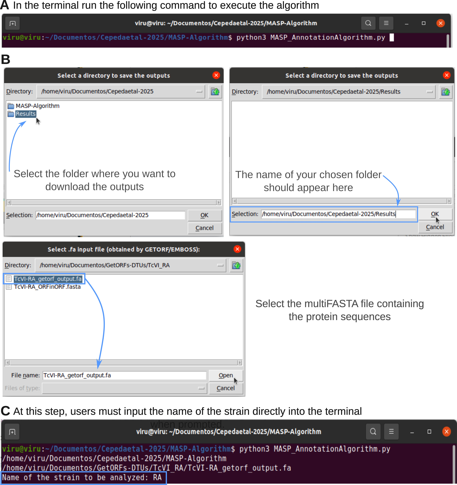

# Annotation and classification of Mucin Associated Surface Proteins (MASP) in _Trypanosoma cruzi_

# 📍What is Disruptomics? 

We herein developed a bioinformatic protocol for the accurate identification, characterization, quantitation and annotation of MASP molecules.

# 📝NOTE
From GENOME

To start you must run your genome sequence in getorf EMBOSS: (we recommend these parameters)

 ```getorf -minsize 120 -maxsize 20100 -find 1  ```

The output obtained in EMBOSS will be the input of the algorithm. 

From PROTEOME

 ⚠️In case you want to run a protein fasta file,  you must ensure that the header of the sequences have the same format as EMBOSS.⚠️
Example: >XX_2517_1_1_1 [224 - 382]

# 💻How to run Disruptomics?
Depending on the user's preferences and the computer being used, the algorithm can be executed in two modes:

-***With a graphical interface***, which provides interactive pop-up windows for file selection, making the process more user-friendly.

-***Without a graphical interface***, allowing the algorithm to run entirely through the terminal, enabling streamlined execution and interaction directly via command-line inputs.

-------------------------------------------------------------------------------------------------------------------------------------------------------------------------------------

To execute the algorithm, first download the ZIP file named MASP-Algorithm.zip (for the graphical interface) or MASP-AlgorithmTerminal.zip (for the terminal interface) from the GitHub repository and save it in your Downloads folder. Open the Downloads folder on your computer, locate the ZIP file, and unzip it into your desired folder.
A new folder named MASP-Algorithm (or MASP-AlgorithmTerminal) will be created, containing the Python script and the necessary HMM matrices (Fig. 1A). Open a new terminal and navigate to this folder. You can do this manually in the terminal, or for convenience, right-click on the folder and select “Open in Terminal” to automatically set the terminal to the correct directory (Fig. 1B). 

**Note!!**: Make sure you download the ZIP folder containing dependent files and the algorithm inside. Unzip the file, and NOT DELETE anything that is inside of the folder.


**Once you are in the correct directory, proceed with the desired execution mode as described below.**

-------------------------------------------------------------------------------------------------------------------------------------------------------------------------------------
-***With a graphical interface***  

You run in the terminal (Fig. 2A):
 ```python3 MASP_AnnotationAlgorithm.py  ```

First, the user has to select the directory where all outputs will be stored (Fig. 2B). Next, the user should select the multiFASTA file containing the protein sequences, which can also be the output file generated by the EMBOSS GetORF function (Fig. 2B). Once this is completed, one prompt will appear in the terminal, where the user can enter the name of the strain to be analyzed, which will be used in the names of the outputs  (Fig 2C)




-------------------------------------------------------------------------------------------------------------------------------------------------------------------------------------

-***Without a graphical interface***

You run in the terminal (Fig. 3A):
 ```python3 MASP_AnnotationAlgorithmTerminal.py  ```

First, the user has to specify the path of the directory where all outputs will be stored (Fig. 3B). Next, the user should insert the path to the multiFASTA file containing the protein sequences, which can also be the output file generated by the EMBOSS GetORF function (Fig. 3C). Once this is completed, the user can enter the name of the strain to be analyzed, which will be used in the names of the outputs  (Fig 3D). 


-------------------------------------------------------------------------------------------------------------------------------------------------------------------------------------
Regardless of the strategy selected to execute the algorithm, once the above steps have been performed, the user will see the following messages on the terminal. These detail and confirm the execution of each of the steps performed by the algorithm, displaying updates on its progress like this: 

The algorithm will then begin running, displaying updates on its progress like this: 
 ```All internal Methionines were calculated
All N-terminal of the entered sequences were analyzed. 
All C-terminal of the entered sequences were analyzed. 
Analyzing and annotating MASP sequences
Searching for chimeric sequences
All sequences were classified
Selecting sequences according to hierarchical ranking
Finished selecting sequences according to hierarchical ranking
Once the classification and annotation of MASPs is finished, the following messages will be displayed on the terminal:
FASTA files generated by prediction of the algorithm.
GFF file generated: /home/user/Selected_Folder/MASP_Strain_XX_sequences.gff
The information has been stored in /home/user/Selected_Folder/README_Strain_XX.txt 
```

# ✔️Dependencies 
You should know that this tool, in order to operate correctly, needs some libraries installed previously.

--> Pandas version 2.8.0 and upwards

--> PyHMMER from  https://pyhmmer.readthedocs.io/en/stable/

--> tkinter (is the default Python interface to the Tk GUI toolkit)

--> In some cases, depending on the computer, installation of Jinja2 may be required. https://jinja.palletsprojects.com/en/stable/
